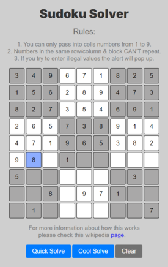
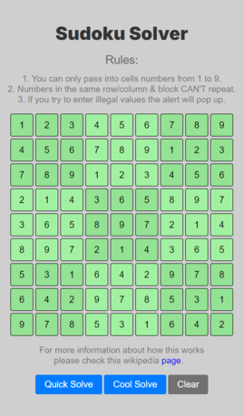
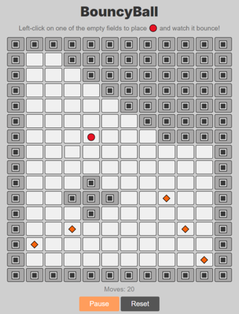
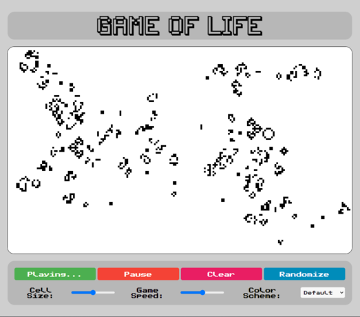
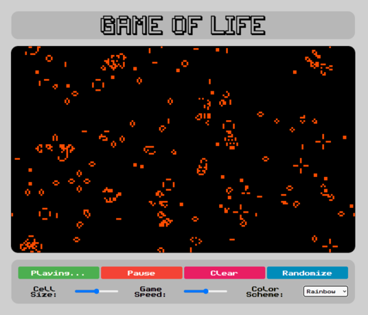

# JavaScript Exam

This is a simple web-app made with HTML, CSS, JS and GSAP. This app was created as a final examination of postgraduate level JavaScript Studies.
 
You can check the live version here:

You can play 3 simple games: https://klukas18.github.io/js-studies-exam/

# 1. SudokuSolver

- Based on clasic sudoku game. You can either input digits that meet game conditions or let the game figure itself out. You can also chose an option to see how backtracking algorithm solves the board cell after cell.

 

# 2. Bouncy

- Animated ball traveling through the game board. Shows randomized collisions with walls and direction changing diamonds. It also has a counter that displays moves.

# 3. Game of Life

- John Conway's cellular automaton where simple rules govern the evolution of a grid of cells. Starting from an initial pattern, cells live, die, or reproduce based on the number of neighboring cells. Despite its simplicity, the game can produce incredibly complex and unpredictable patterns, showcasing the emergence of order from randomness.

 

Intro animation:
 

> GSAP (GreenSock Animation Platform)

The app is made with:

> HTML / CSS,
> Vanilla JavaScript

